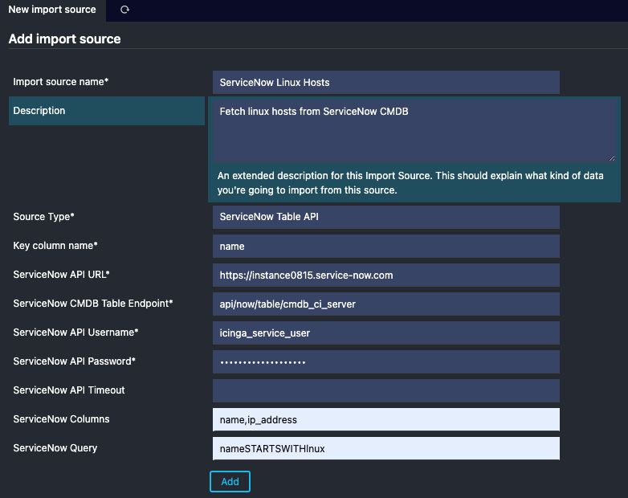
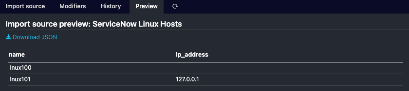

# Configuration

Create a new Icinga Director Import Source and use "ServiceNow Table API" as the source type.

## Settings

**ServiceNow API URL:** The base URL to your ServiceNow instance. (e.g. `https://instance0815.service-now.com`)

**ServiceNow CMDB Table Endpoint:**  The API endpoint to fetch objects from.

An official list of available tables can be found [here](https://www.servicenow.com/docs/bundle/yokohama-servicenow-platform/page/product/configuration-management/reference/cmdb-tables-details.html?state=seamless).
Since we wanted to make it as customizable as possible, we don't have a hard-coded API method. Therefore, you have to provide the full endpoint for the table here (e.g. `api/now/table/cmdb_ci_server`).

**Servicenow Auth Methos:** Allows you to chosse between basic auth and token based auth as described in https://www.servicenow.com/docs/bundle/zurich-platform-security/page/integrate/authentication/task/configure-api-key.html

**ServiceNow API Username:** User to authenticate against the ServiceNow API.
This user needs to have read access to the table you want to import.

**ServiceNow API Password:** Password to authenticate against the ServiceNow API.

**ServiceNow API Key:** API Key for token based auth

**ServiceNow API Timeout:** Timeout for the API request in seconds. Default is `20` seconds.

**ServiceNow Columns:** List of columns to fetch.

Per default, we fetch all available columns. In case you want to limit the columns, you can provide a comma separated list of columns here. (e.g. `name,ip_address`)

**ServiceNow Query:** Filters for the query.

Per default, no filter limitation is applied to the query. The whole table will be fetched. In case you want to limit the objects, you can provide a filter query here.

To filter, you will need to follow the [official filter syntax from ServiceNow](https://www.servicenow.com/docs/bundle/yokohama-platform-user-interface/page/use/using-lists/concept/c_EncodedQueryStrings.html) An example could be `nameSTARTSWITHlnux`.
